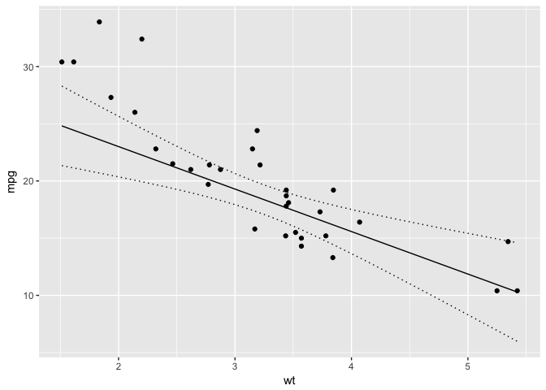

<!-- README.md is generated from README.Rmd. Please edit that file -->
[](https://travis-ci.org/poissonconsulting/newdata) [](https://ci.appveyor.com/project/poissonconsulting/newdata) [](https://codecov.io/gh/poissonconsulting/newdata)

newdata
=======

Introduction
------------

`newdata` is an R package to generate newdata frames for predict functions.

Utilization
-----------

``` r
library(datasets)
library(ggplot2)
library(newdata)

model <- lm(circumference ~ age + Tree + age:Tree, data = Orange)

age <- new_data(Orange, c("age", "Tree"))

age$circumference <- predict(model, newdata = age)

ggplot(data = Orange, aes(x = age, y = circumference, color = Tree)) + 
  geom_point() + geom_line(data = age)
```



Installation
------------

To install the latest version from GitHub

    # install.packages("devtools")
    devtools::install_github("poissonconsulting/newdata")

Contribution
------------

Please report any [issues](https://github.com/poissonconsulting/newdata/issues).

[Pull requests](https://github.com/poissonconsulting/newdata/pulls) are always welcome.
