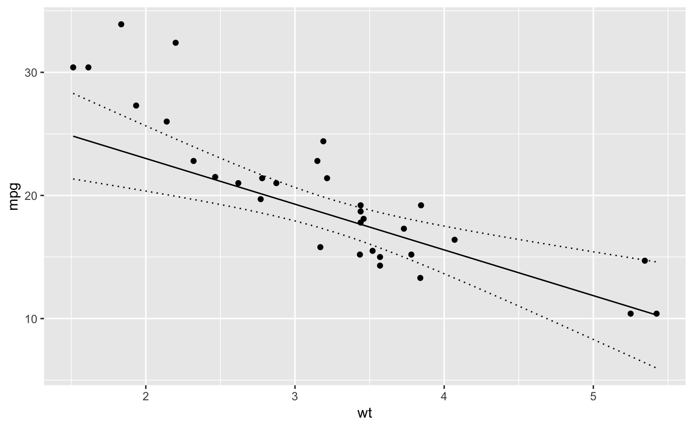
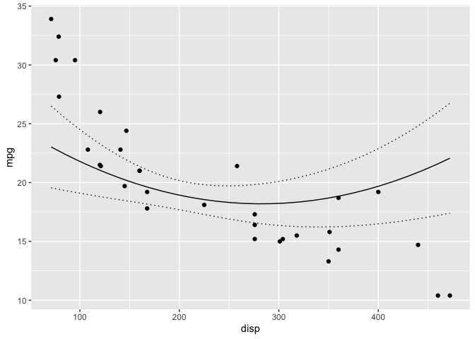

<!-- README.md is generated from README.Rmd. Please edit that file -->
 [](https://travis-ci.org/poissonconsulting/newdata) [](https://ci.appveyor.com/project/poissonconsulting/newdata) [](https://codecov.io/gh/poissonconsulting/newdata) [](https://opensource.org/licenses/MIT)

newdata
=======

Introduction
------------

`newdata` is an R package to generate new data frames for passing to `predict` functions. In the new data the column or columns of interest vary across their range while the remaining columns are held constant at their reference value.

The reference value for a factor is its first level, while the reference level for columns of other types are the mean or rounded mean in the case of logicals, integers, Dates or POSIXcts.

Demonstration
-------------

``` r
library(ggplot2)
library(newdata)

mtcars <- datasets::mtcars

model <- lm(mpg ~ wt + hp + poly(disp,2), data = mtcars)
summary(model)
#> 
#> Call:
#> lm(formula = mpg ~ wt + hp + poly(disp, 2), data = mtcars)
#> 
#> Residuals:
#>     Min      1Q  Median      3Q     Max 
#> -3.3887 -1.6079 -0.3997  1.7992  4.2331 
#> 
#> Coefficients:
#>                Estimate Std. Error t value Pr(>|t|)    
#> (Intercept)    35.13941    3.53184   9.949 1.58e-10 ***
#> wt             -3.71314    0.91483  -4.059 0.000379 ***
#> hp             -0.02115    0.01026  -2.062 0.048978 *  
#> poly(disp, 2)1 -4.09195    6.21246  -0.659 0.515687    
#> poly(disp, 2)2  7.87570    2.36778   3.326 0.002546 ** 
#> ---
#> Signif. codes:  0 '***' 0.001 '**' 0.01 '*' 0.05 '.' 0.1 ' ' 1
#> 
#> Residual standard error: 2.263 on 27 degrees of freedom
#> Multiple R-squared:  0.8772, Adjusted R-squared:  0.859 
#> F-statistic:  48.2 on 4 and 27 DF,  p-value: 6.521e-12

# generate a data frame across range of wt with other predictor
# variables held constant
wt <- new_data(mtcars, "wt")
head(wt)
#> # A tibble: 6 × 11
#>        mpg    cyl     disp       hp     drat       wt     qsec     vs
#>      <dbl>  <dbl>    <dbl>    <dbl>    <dbl>    <dbl>    <dbl>  <dbl>
#> 1 20.09062 6.1875 230.7219 146.6875 3.596563 1.513000 17.84875 0.4375
#> 2 20.09062 6.1875 230.7219 146.6875 3.596563 1.647862 17.84875 0.4375
#> 3 20.09062 6.1875 230.7219 146.6875 3.596563 1.782724 17.84875 0.4375
#> 4 20.09062 6.1875 230.7219 146.6875 3.596563 1.917586 17.84875 0.4375
#> 5 20.09062 6.1875 230.7219 146.6875 3.596563 2.052448 17.84875 0.4375
#> 6 20.09062 6.1875 230.7219 146.6875 3.596563 2.187310 17.84875 0.4375
#> # ... with 3 more variables: am <dbl>, gear <dbl>, carb <dbl>

wt <- cbind(wt, predict(model, newdata = wt, interval = "confidence"))

ggplot(data = wt, aes(x = wt, y = fit)) + 
  geom_point(data = mtcars, aes(y = mpg)) + 
  geom_line() +
  geom_line(aes(y = lwr), linetype = "dotted") +
  geom_line(aes(y = upr), linetype = "dotted") +
  ylab("mpg")
```



``` r

# generate a data frame across range of disp with other predictor
# variables held constant
disp <- new_data(mtcars, "disp")
head(disp)
#> # A tibble: 6 × 11
#>        mpg    cyl      disp       hp     drat      wt     qsec     vs
#>      <dbl>  <dbl>     <dbl>    <dbl>    <dbl>   <dbl>    <dbl>  <dbl>
#> 1 20.09062 6.1875  71.10000 146.6875 3.596563 3.21725 17.84875 0.4375
#> 2 20.09062 6.1875  84.92414 146.6875 3.596563 3.21725 17.84875 0.4375
#> 3 20.09062 6.1875  98.74828 146.6875 3.596563 3.21725 17.84875 0.4375
#> 4 20.09062 6.1875 112.57241 146.6875 3.596563 3.21725 17.84875 0.4375
#> 5 20.09062 6.1875 126.39655 146.6875 3.596563 3.21725 17.84875 0.4375
#> 6 20.09062 6.1875 140.22069 146.6875 3.596563 3.21725 17.84875 0.4375
#> # ... with 3 more variables: am <dbl>, gear <dbl>, carb <dbl>

disp <- cbind(disp, predict(model, newdata = disp, interval = "confidence"))

ggplot(data = disp, aes(x = disp, y = fit)) + 
  geom_point(data = mtcars, aes(y = mpg)) + 
  geom_line() +
  geom_line(aes(y = lwr), linetype = "dotted") +
  geom_line(aes(y = upr), linetype = "dotted") +
  ylab("mpg")
```



Installation
------------

To install the latest version from GitHub

    # install.packages("devtools")
    devtools::install_github("poissonconsulting/newdata")

Contribution
------------

Please report any [issues](https://github.com/poissonconsulting/newdata/issues).

[Pull requests](https://github.com/poissonconsulting/newdata/pulls) are always welcome.

Please note that this project is released with a [Contributor Code of Conduct](CONDUCT.md). By participating in this project you agree to abide by its terms.
