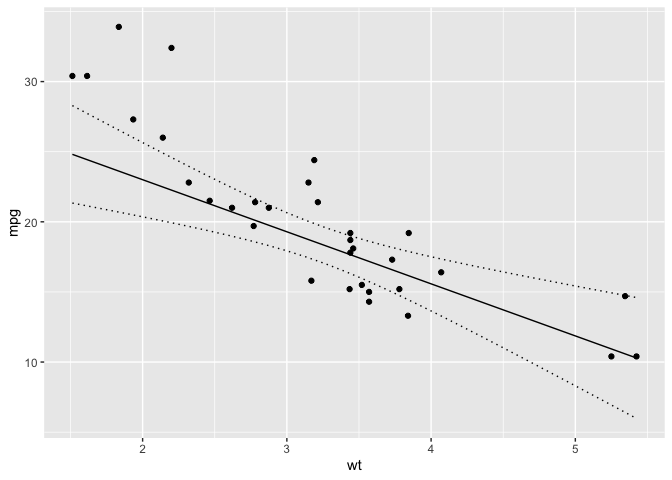

<!-- README.md is generated from README.Rmd. Please edit that file -->
<!-- badges: start -->

[](https://lifecycle.r-lib.org/articles/stages.html#experimental)
[](https://github.com/poissonconsulting/newdata/actions/workflows/R-CMD-check.yaml)
[](https://codecov.io/gh/poissonconsulting/newdata?branch=master)
[](https://opensource.org/licenses/MIT)
[](https://CRAN.R-project.org/package=newdata)
<!-- badges: end -->

# newdata

## Introduction

`newdata` is an R package to generate new data frames for passing to
`predict` functions. In the new data the column(s) of interest vary
across their range while the remaining columns are held constant at
their reference value.

For more information see `new_data()`.

## Demonstration

``` r
library(ggplot2)
library(newdata)

mtcars <- datasets::mtcars

model <- lm(mpg ~ wt + hp + poly(disp, 2), data = mtcars)

# generate a data frame across range of disp with other predictor
# variables held constant
disp <- new_data(mtcars, "disp")
head(disp)
#> # A tibble: 6 × 11
#>     mpg   cyl  disp    hp  drat    wt  qsec    vs    am  gear  carb
#>   <dbl> <dbl> <dbl> <dbl> <dbl> <dbl> <dbl> <dbl> <dbl> <dbl> <dbl>
#> 1  20.1  6.19  71.1  147.  3.60  3.22  17.8 0.438 0.406  3.69  2.81
#> 2  20.1  6.19  84.9  147.  3.60  3.22  17.8 0.438 0.406  3.69  2.81
#> 3  20.1  6.19  98.7  147.  3.60  3.22  17.8 0.438 0.406  3.69  2.81
#> 4  20.1  6.19 113.   147.  3.60  3.22  17.8 0.438 0.406  3.69  2.81
#> 5  20.1  6.19 126.   147.  3.60  3.22  17.8 0.438 0.406  3.69  2.81
#> 6  20.1  6.19 140.   147.  3.60  3.22  17.8 0.438 0.406  3.69  2.81

disp <- cbind(disp, predict(model, newdata = disp, interval = "confidence"))

ggplot(data = disp, aes(x = disp, y = fit)) +
  geom_point(data = mtcars, aes(y = mpg)) +
  geom_line() +
  geom_line(aes(y = lwr), linetype = "dotted") +
  geom_line(aes(y = upr), linetype = "dotted") +
  ylab("mpg")
```

<!-- -->

## Installation

To install the latest development version from
[GitHub](https://github.com/poissonconsulting/newdata)

    # install.packages("remotes")
    remotes::install_github("poissonconsulting/newdata")

## Contribution

Please report any
[issues](https://github.com/poissonconsulting/newdata/issues).

[Pull requests](https://github.com/poissonconsulting/newdata/pulls) are
always welcome.

## Code of Conduct

Please note that the newdata project is released with a [Contributor
Code of
Conduct](https://contributor-covenant.org/version/2/1/CODE_OF_CONDUCT.html).
By contributing to this project, you agree to abide by its terms.
